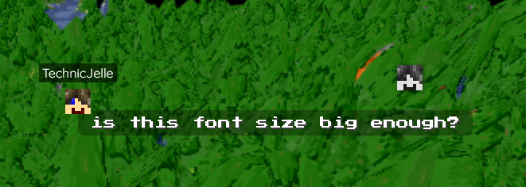
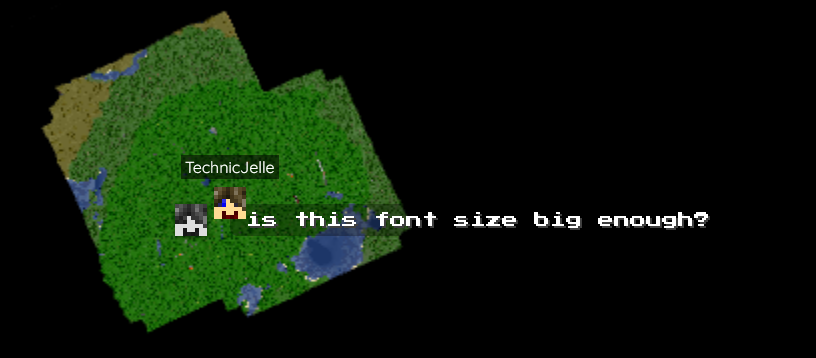
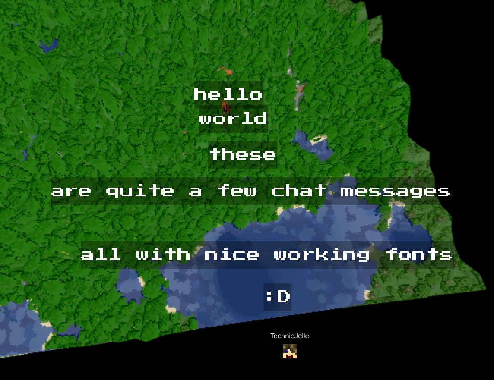

# BlueMap VentureChat Markers

This Paper plugin adds VentureChat markers to [BlueMap](https://github.com/BlueMap-Minecraft/Bluemap). It is a fork of [BlueMapChatMarkers](https://github.com/TechnicJelle/BlueMapChatMarkers) with the only changes being added support for VentureChat events and a few more config options necessary for this new integration (see default [config.yml](src/main/resources/config.yml) under "VentureChat" for a detailed description).

Compatible with Paper 1.13+, just like BlueMap itself.

You can customise the style of the markers with the `textStyle.css` file in the config directory.\
To reload it, just reload BlueMap itself with `/bluemap reload`.

## [Click here to download!](../../releases/latest)

## Support

To get support with this plugin, join the [BlueMap Discord server](https://bluecolo.red/map-discord) and ask your questions in [#3rd-party-support](https://discord.com/channels/665868367416131594/863844716047106068). You're welcome to ping me, @TechnicJelle (or @Mark_225 if the question is specifically about the VentureChat integration).

\

